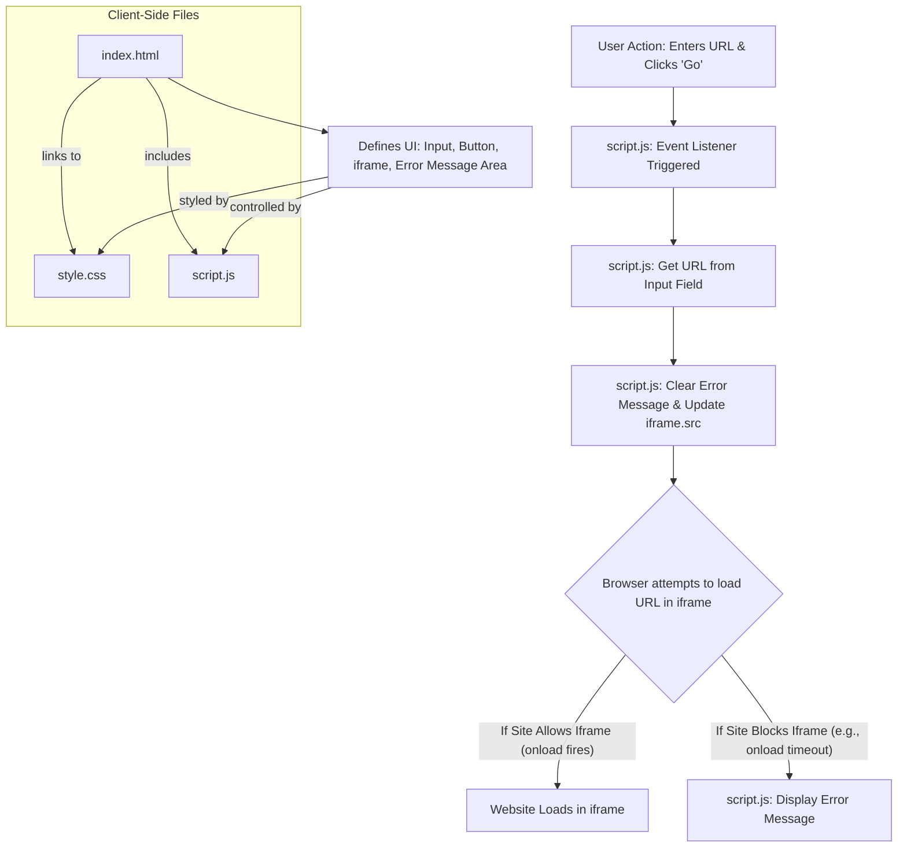

# Project Plan: Simple Web Browser Application

**Project Goal:** Create an HTML, CSS, and JavaScript web application that functions as a basic web browser, allowing users to enter a URL and view the corresponding website within an iframe.

**Phase 1: Scaffolding and Basic Functionality**

1.  **Create `index.html`**:
    *   This file will be the main page.
    *   It will include:
        *   An input field for the user to type a URL (e.g., `<input type="text" id="urlInput">`).
        *   A 'Go' button (e.g., `<button id="goButton">Go</button>`).
        *   An `iframe` to display the loaded web page (e.g., `<iframe id="contentFrame"></iframe>`).
        *   A link to the `style.css` file for styling.
        *   A script tag to include `script.js` for functionality (preferably at the end of the body).
    *   A message area to inform users if a site cannot be loaded (e.g., `

`).

2.  **Create `style.css`**:
    *   This file will provide basic styling for:
        *   The overall page layout.
        *   The URL input field and 'Go' button.
        *   The `iframe` container.
        *   The error message area.

3.  **Create `script.js`**:
    *   This file will handle the browser's logic:
        *   Get references to the DOM elements: URL input, 'Go' button, `iframe`, and error message area.
        *   Add an event listener to the 'Go' button.
        *   When the 'Go' button is clicked:
            *   Clear any previous error messages.
            *   Retrieve the URL entered in the input field.
            *   Validate the URL (basic check for http/https).
            *   Set the `src` attribute of the `iframe` to this URL.
            *   Implement a way to detect iframe loading errors (e.g., listening to the `iframe`'s `onload` and potentially `onerror` events, though `onerror` for cross-origin content is unreliable). A common approach is to use a timeout: if `onload` doesn't fire within a certain period, assume it's blocked.
            *   If an error is detected or suspected (e.g., after a timeout and `onload` hasn't fired), display a message in the error message area like: "This site cannot be loaded in an iframe due to its security settings (e.g., X-Frame-Options or Content-Security-Policy)."

**Visual Plan (Mermaid Diagram):**

**Approach for Iframe Loading Restrictions:**

*   The application will be purely client-side.
*   It will attempt to load the URL directly into the `iframe`.
*   If a website cannot be loaded due to security headers like `X-Frame-Options` or `Content-Security-Policy`, the application will inform the user with a message explaining the limitation. No server-side proxy will be implemented in this initial version.